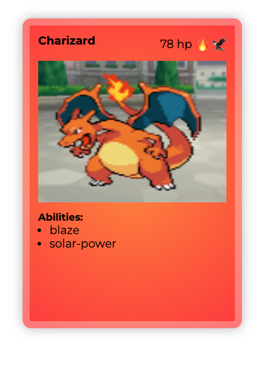

# Cartas Pokémon

Crear 4 cartas pokemon con html y css, siguiendo las siguientes directrices:

- Clonar el [siguiente repositorio](https://github.com/rodri-afa/pokecartas)
- Crear una carta para los siguientes pokemon: bulbasaur, charmander, squirtle y pikachu
- Las imágenes de los pokemon se adjuntan en la carpeta "img". También se adjunta una imagen de cómo se tendría que ver una carta
- Las 4 cartas se han de mostrar en una misma fila (utilizar la propiedad float)
- Cada carta estará compuesta por los siguientes divs:
  - **Cabecera:** donde se recoge el nombre del pokemon, los puntos de vida y los tipos
  - **Imagen:** con una imagen de fondo(pokemon-background.png) y la imagen del pokemon a mostrar
  - **Habilidades:** con un listado de las diferentes habilidades (consultar la [pokeapi](https://pokeapi.co/) para ver las habilidades de cada pokemon)
- Cada carta tiene una serie de estilos comunes que se los dará una **clase general** para todas las cartas :
  - los bordes redondeados,
  - un borde amarillo de 4 píxeles
  - sombra al rededor
- El fondo de cada carta tiene que ser de un color coherente con el tipo de pokemon (tipo fuego: fondo rojo, tipo agua: azul,etc) Crear una **clase para cada tipo de pokemon**. Dicha clase se ocupará simplemente de dar los atributos del color de fondo
- Crear el CSS en un fichero separado y referenciarlo de forma relativa

### Ejemplo

